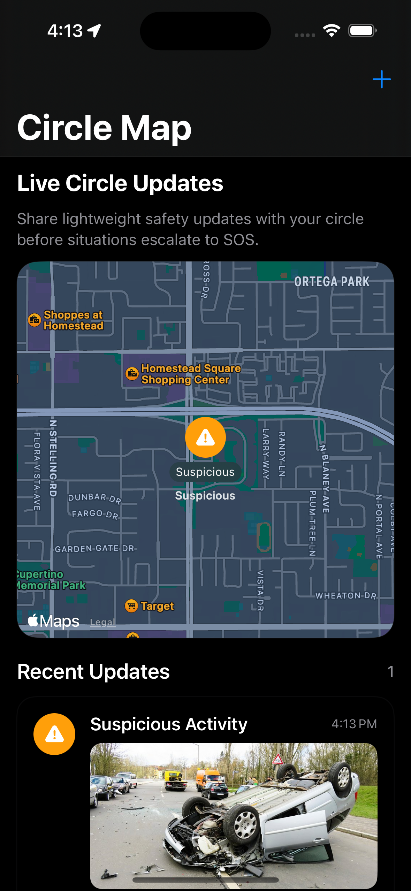

# Circle-Safety-Update

## Overview

Circle Safety Update is an iOS feature concept built for the Obserc Safety Hackathon (Track 1). It allows users to quickly share **location-based safety updates** with their trusted circle using a map interface.

Instead of relying only on emergency SOS alerts, this feature introduces a **lightweight, proactive communication layer** for everyday safety situations.

---

## How It Works:

1. Launch the app
2. Tap the `+` button
3. Create a safety update
4. View it on the map and in Recent Updates
5. Tap the card → opens Apple Maps navigation

---

## Screenshots

  

---
## Problem

In real-world safety scenarios, not every situation requires triggering a full SOS alert.

Users often experience situations like:

* Feeling uncomfortable in a location
* Running late at night
* Needing a ride home
* Noticing suspicious activity nearby

However, existing systems (like SOS) are:

* Too **heavyweight** for these cases
* Too **visible**, which can be unsafe in certain situations
* Not designed for **frequent, low-friction communication**

As a result, users either:

* Do nothing
* Or hesitate to use emergency tools

---

## Solution

Circle Safety Update fills the gap between passive check-ins and full emergency alerts.

Users can:

* Open the map
* Tap the **“+” button**
* Select a safety update type
* Optionally attach a **photo for context**
* Share the update with their circle

This enables:

* Faster awareness
* Better context (via photos + notes)
* Safer communication without escalation

---

## How It Works

1. User taps the `+` button on the map screen
2. Selects a safety update type
3. Adds an optional note and photo
4. Chooses a location (demo coordinates)
5. Shares the update

## How This Integrates with Obserc

This feature is designed as an extension to Obserc’s existing system:

* Works alongside **SOS Beacon** 
* Adds a **pre-SOS communication layer**
* Enhances **Circle awareness**

